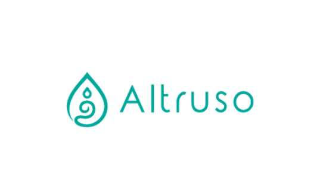


<!-- Improved compatibility of back to top link: See: https://github.com/othneildrew/Best-README-Template/pull/73 -->
<a name="readme-top"></a>
<!--
*** Thanks for checking out the Best-README-Template. If you have a suggestion
*** that would make this better, please fork the repo and create a pull request
*** or simply open an issue with the tag "enhancement".
*** Don't forget to give the project a star!
*** Thanks again! Now go create something AMAZING! :D
-->


<!-- PROJECT LOGO -->
<br />
<div align="center">
  
  </a>

  <h1 align="center">ALTRUSO</h1>


<!-- 
<!-- TABLE OF CONTENTS -->
<!-- <details> -->
  <!-- <summary>Table of Contents</summary>
  <ol>
    <li>
      <a href="#about-the-project">About The Project</a>
      <ul>
        <li><a href="#built-with">Built With</a></li>
      </ul>
    </li>
    <li>
      <a href="#getting-started">Getting Started</a>
      <ul>
        <li><a href="#prerequisites">Prerequisites</a></li>
        <li><a href="#installation">Installation</a></li>
      </ul>
    </li>
    <li><a href="#usage">Usage</a></li>
    <li><a href="#roadmap">Roadmap</a></li>
    <li><a href="#contributing">Contributing</a></li>
    <li><a href="#license">License</a></li>
    <li><a href="#contact">Contact</a></li>
    <li><a href="#acknowledgments">Acknowledgments</a></li>
  </ol>
</details> -->


<!-- ABOUT THE PROJECT -->
## What is Altruso

Altruso: Empowering Ideas, Uniting Generosity

Altruso, a visionary crowdfunding platform, transcends the ordinary boundaries of fundraising by revolutionizing the way individuals and communities come together to ignite change. Our name, derived from "altruism" and "trust," embodies our unwavering commitment to fostering a spirit of generosity, empathy, and social impact.

At Altruso, we believe in the boundless power of ideas. We provide a dynamic virtual space where dreamers, innovators, and passionate individuals can transform their visions into reality. Our platform serves as a catalyst for inspiration, connecting creative minds with the resources they need to propel their projects forward.

With Altruso, raising funds for your passion projects becomes a seamless journey. Through our intelligent and intuitive interface, project creators can showcase their ventures in captivating ways, captivating the hearts and minds of potential backers. We empower creators to present their ideas with stunning visuals, compelling storytelling, and engaging multimedia content that captivates and resonates with our vibrant community.

What sets Altruso apart is our unwavering dedication to building a supportive and interconnected ecosystem. We understand that crowdfunding is more than just a financial transaction—it's a shared experience that thrives on trust, collaboration, and meaningful connections. Our robust social features foster a sense of camaraderie, enabling project creators and backers to engage in vibrant discussions, offer feedback, and forge lasting relationships.

In an era where giving back matters more than ever, Altruso is committed to making a profound impact on society. We hold ourselves to the highest standards of integrity and transparency, ensuring that every donated dollar is utilized effectively and responsibly. Our secure payment system, combined with stringent privacy measures, safeguards the financial well-being of our users and protects their valuable personal information.

At Altruso, we believe in the transformative power of collective action. We leverage cutting-edge analytics and monitoring tools to derive actionable insights, enabling us to continuously improve our platform's performance and optimize the user experience. With every success story and lesson learned, we evolve, ensuring that Altruso remains at the forefront of innovation in the crowdfunding landscape.

Join Altruso today and embark on an extraordinary journey of giving, innovation, and impact. Together, we can shape a better future, one idea at a time.

<p align="right">(<a href="#readme-top">back to top</a>)</p>


### Built With


* [![React][React.js]][React-url]
* many more...


<p align="right">(<a href="#readme-top">Back to top</a>)</p>


<!-- GETTING STARTED -->

<!-- 
This is an example of how you may give instructions on setting up your project locally.
To get a local copy up and running follow these simple example steps.

### Prerequisites

This is an example of how to list things you need to use the software and how to install them.
* npm
  ```sh
  npm install npm@latest -g
  ```

### Installation

_Below is an example of how you can instruct your audience on installing and setting up your app. This template doesn't rely on any external dependencies or services._

1. Get a free API Key at [https://example.com](https://example.com)
2. Clone the repo
   ```sh
   git clone https://github.com/your_username_/Project-Name.git
   ```
3. Install NPM packages
   ```sh
   npm install
   ```
4. Enter your API in `config.js`
   ```js
   const API_KEY = 'ENTER YOUR API';
   ```

<p align="right">(<a href="#readme-top">back to top</a>)</p> -->

<!-- 

<!-- USAGE EXAMPLES -->
<!-- ## Usage

Use this space to show useful examples of how a project can be used. Additional screenshots, code examples and demos work well in this space. You may also link to more resources.

_For more examples, please refer to the [Documentation](https://example.com)_

<p align="right">(<a href="#readme-top">back to top</a>)</p>
 -->

 


<!-- ROADMAP -->
## Crowdfunding Website Roadmap

### Planning
- [ ] Define Project Scope and Goals <!-- Determine the objectives and boundaries of the project -->
- [ ] Research Crowdfunding Platforms <!-- Explore different crowdfunding platforms available -->
- [ ] Choose a Platform <!-- Select the most suitable crowdfunding platform for your website -->

### Design and Development
- [ ] Develop UI Design <!-- Create an appealing and user-friendly design for the website -->
- [ ] User Registration and Login  <!-- Implement functionality for users to register and log in -->
- [ ] Create Project Form <!-- Design a form for campaign creators to submit their projects -->
- [ ] Payment Integration <!-- Integrate a payment gateway for collecting funds -->
- [ ] Project Listing and Search <!-- Implement features to display and search for campaigns -->
- [ ] Project Detail Pages <!-- Design and develop individual campaign pages -->
- [ ] Social Sharing Features <!-- Include options for users to share campaigns on social media -->

### Backer Management
- [ ] Set Up Backer Rewards System <!-- Establish a system for offering rewards to campaign backers -->
- [ ] Implement Project Updates and Communication Tools <!-- Enable campaign creators to communicate updates to backers -->
- [ ] Build Backer Management and Data Tracking Functionality <!-- Develop functionality to manage and track backers -->

### Campaign Creator Management
- [ ] Create Campaign Dashboard <!-- Build a dashboard for campaign creators to manage their campaigns -->
- [ ] Track Funding Progress <!-- Implement features to track and display the funding progress of campaigns -->
- [ ] Manage Backer Rewards <!-- Allow campaign creators to define and manage the rewards for backers -->
- [ ] Communicate with Backers <!-- Enable campaign creators to communicate with their backers -->

### Administration and Analytics
- [ ] Integrate Analytics and Reporting Tools <!-- Implement tools for tracking website performance and user behavior -->
- [ ] Implement User Reviews and Ratings System <!-- Enable users to provide reviews and ratings -->
- [ ] Develop Admin Panel for Content Management <!-- Create an administrative panel for managing website content -->

### Optimization and Launch
- [ ] Ensure Mobile Responsiveness <!-- Ensure the website is fully responsive on mobile devices -->
- [ ] Perform User Testing and Debugging <!-- Conduct thorough testing and debugging of the website -->

<p align="right">(<a href="#readme-top">Back to top</a>)</p>


<!-- CONTRIBUTING -->
<!-- 
## Contributing

Contributions are what make the open source community such an amazing place to learn, inspire, and create. Any contributions you make are **greatly appreciated**.

If you have a suggestion that would make this better, please fork the repo and create a pull request. You can also simply open an issue with the tag "enhancement".
Don't forget to give the project a star! Thanks again!

1. Fork the Project
2. Create your Feature Branch (`git checkout -b feature/AmazingFeature`)
3. Commit your Changes (`git commit -m 'Add some AmazingFeature'`)
4. Push to the Branch (`git push origin feature/AmazingFeature`)
5. Open a Pull Request

<p align="right">(<a href="#readme-top">back to top</a>)</p> -->


<!-- LICENSE -->
<!-- ## License

Distributed under the MIT License. See `LICENSE.txt` for more information.

<p align="right">(<a href="#readme-top">Back to top</a>)</p> -->


<!-- CONTACT -->
## Contact
Pankaj Bist- pankajbist000@gmail.com

Project Link: [https://github.com/Pankajbist/Altruso](https://github.com/Pankajbist/Altruso)

<p align="right">(<a href="#readme-top">Back to top</a>)</p> 


<!-- MARKDOWN LINKS & IMAGES -->
<!-- https://www.markdownguide.org/basic-syntax/#reference-style-links -->
[contributors-shield]: https://img.shields.io/github/contributors/othneildrew/Best-README-Template.svg?style=for-the-badge
[contributors-url]: https://github.com/othneildrew/Best-README-Template/graphs/contributors
[forks-shield]: https://img.shields.io/github/forks/othneildrew/Best-README-Template.svg?style=for-the-badge
[forks-url]: https://github.com/othneildrew/Best-README-Template/network/members
[stars-shield]: https://img.shields.io/github/stars/othneildrew/Best-README-Template.svg?style=for-the-badge
[stars-url]: https://github.com/othneildrew/Best-README-Template/stargazers
[issues-shield]: https://img.shields.io/github/issues/othneildrew/Best-README-Template.svg?style=for-the-badge
[issues-url]: https://github.com/othneildrew/Best-README-Template/issues
[license-shield]: https://img.shields.io/github/license/othneildrew/Best-README-Template.svg?style=for-the-badge
[license-url]: https://github.com/othneildrew/Best-README-Template/blob/master/LICENSE.txt
[linkedin-shield]: https://img.shields.io/badge/-LinkedIn-black.svg?style=for-the-badge&logo=linkedin&colorB=555
[linkedin-url]: https://linkedin.com/in/othneildrew
[product-screenshot]: images/screenshot.png
[Next.js]: https://img.shields.io/badge/next.js-000000?style=for-the-badge&logo=nextdotjs&logoColor=white
[Next-url]: https://nextjs.org/
[React.js]: https://img.shields.io/badge/React-20232A?style=for-the-badge&logo=react&logoColor=61DAFB
[React-url]: https://reactjs.org/
[Vue.js]: https://img.shields.io/badge/Vue.js-35495E?style=for-the-badge&logo=vuedotjs&logoColor=4FC08D
[Vue-url]: https://vuejs.org/
[Angular.io]: https://img.shields.io/badge/Angular-DD0031?style=for-the-badge&logo=angular&logoColor=white
[Angular-url]: https://angular.io/
[Svelte.dev]: https://img.shields.io/badge/Svelte-4A4A55?style=for-the-badge&logo=svelte&logoColor=FF3E00
[Svelte-url]: https://svelte.dev/
[Laravel.com]: https://img.shields.io/badge/Laravel-FF2D20?style=for-the-badge&logo=laravel&logoColor=white
[Laravel-url]: https://laravel.com
[Bootstrap.com]: https://img.shields.io/badge/Bootstrap-563D7C?style=for-the-badge&logo=bootstrap&logoColor=white
[Bootstrap-url]: https://getbootstrap.com
[JQuery.com]: https://img.shields.io/badge/jQuery-0769AD?style=for-the-badge&logo=jquery&logoColor=white
[JQuery-url]: https://jquery.com 

